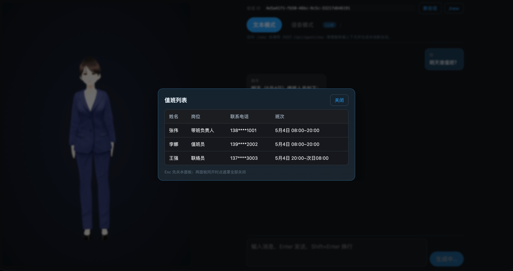
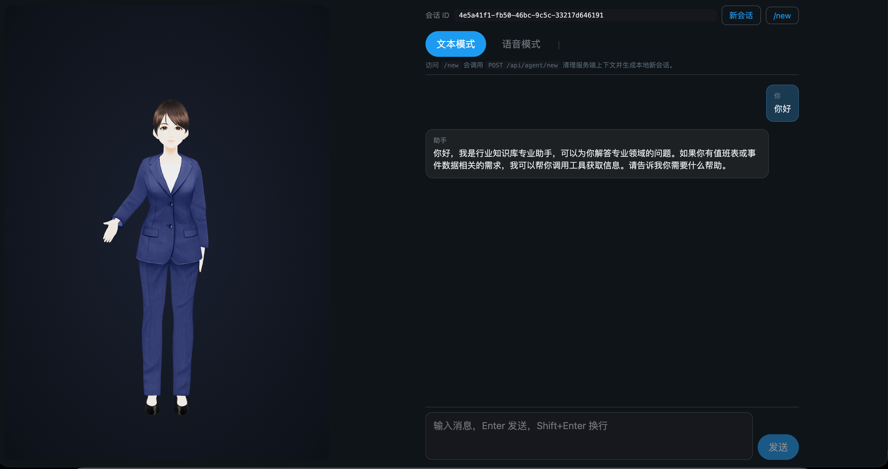
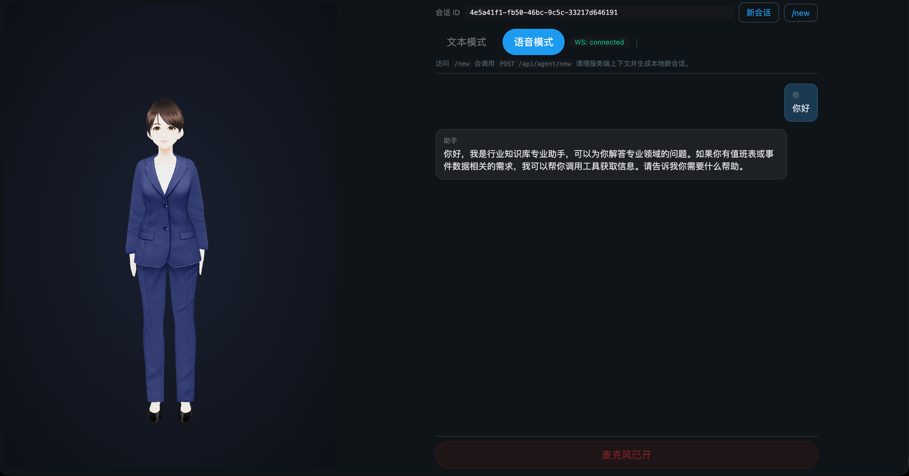

# 数字人智能助手 — Java 实现

[English](README_EN.md)

基于 Qwen3-Omni 多模态大模型的 3D 数字人实时对话系统。Java Spring Boot WebFlux 直连 DashScope WebSocket API，前端 Vue3 + @pixiv/three-vrm 渲染 VRM 数字人。支持文本/语音双模式交互，集成 RAG 知识库检索与 Function Calling 业务工具调用。

> **注意**：项目中的演示数据（值班表、事件列表、RAG 知识库文档）均为虚构示例。





## 核心能力

- **实时语音对话** — Qwen3-Omni 多模态模型端到端处理音频输入/输出，Java 做 WebSocket 中继，无需 ASR/TTS 管道
- **3D 数字人** — Keito VRM 模型 (@pixiv/three-vrm) 实时渲染，音频驱动唇形，状态机控制表情与手势
- **RAG 知识检索** — LangChain4j + ONNX 嵌入模型，知识库向量检索嵌入对话流程
- **业务工具调用** — Omni Function Calling 自动调用值班表、事件面板、知识库搜索
- **双模式运行** — WebSocket 实时语音 / SSE 流式文本，一键切换
- **关键词强制工具** — Java 侧前置检测用户意图，注入指令确保模型调用工具，防止编造

## 技术架构

```
浏览器 ─WS─→ Java (OmniWebSocketHandler) ─WS─→ DashScope Qwen3-Omni
              │                                  │
              ├─ ContentRetriever (RAG)          ├─ 语音识别 (内置)
              ├─ EmergencyDutyUiTools            ├─ LLM 推理 (内置)
              ├─ EmergencyEventUiTools           └─ 语音合成 (内置)
              ├─ 关键词检测 (强制工具调用)
              └─ PersistentChatMemoryStore (MySQL)
```

Qwen3-Omni 是端到端多模态模型，内部已包含 ASR + LLM + TTS。服务端不额外部署语音管道，只做 WebSocket 中继和业务逻辑。

## 技术栈

| 层 | 技术 | 端口 |
|---|---|---|
| 前端 | Vue 3 + Vite 6 + @pixiv/three-vrm v3 + Three.js 0.184 | 5173 |
| 后端 | Spring Boot 3.2.5 (WebFlux) + MyBatis + LangChain4j | 8081 |
| 模型 | DashScope qwen3.5-omni-plus-realtime (WebSocket 实时 API) | 云服务 |
| 数据库 | MySQL 8.0 (Docker/OrbStack) | 3306 |
| 嵌入模型 | BgeSmallEnV15QuantizedEmbeddingModel (本地 ONNX) | 进程内 |
| 知识库 | knowledge-base (用户自行上传文档) | 本地文件 |

## 前置条件

### 必须

| 依赖 | 说明 |
|------|------|
| **DashScope API Key** | 从 [阿里云 DashScope 控制台](https://dashscope.console.aliyun.com/) 获取，按量计费 |
| JDK 17+ | 编译与运行 |
| Node.js 18+ | 前端构建 |

### 可选

| 依赖 | 说明 |
|------|------|
| MySQL 8.0 | 会话记忆持久化（可不启用，不影响核心功能） |
| 本地多模态模型 | 如需离线部署，需自行启动兼容 Omni 协议的本地模型服务 |

## 快速开始

```bash
# 1. 克隆仓库
git clone <repo-url> && cd rag-tools-agent-avatar

# 2. 配置 API Key
#    编辑 src/main/resources/application.yml
#    找到 dashscope.api-key，替换为你的 DashScope API Key

# 3. 启动后端
mvn spring-boot:run

# 4. 另开终端，启动前端
cd frontend
npm install
npm run dev

# 5. 浏览器访问
open http://localhost:5173
```

> 如需要会话持久化，先启动 MySQL 并创建 `demo` 数据库，再执行 `src/main/resources/schema.sql`。

## RAG 知识库配置

知识库文档需用户自行放入 `knowledge-base/` 目录，通过 `application.yml` 中的 `knowledge.base.path` 配置。启动时 `AiMemoryConfig.java` 自动加载并向量化：

```yaml
knowledge:
  base:
    path: knowledge-base
```

支持的文档格式：`.txt`、`.md`、`.pdf`、`.docx`。嵌入模型使用本地 ONNX 运行时，无需外部 API。

## 项目结构

```
├── pom.xml                                          # Maven 依赖
├── knowledge-base/                                   # 知识库文档目录（用户自行上传）
├── src/main/resources/
│   ├── application.yml                              # 全部配置
│   ├── schema.sql                                   # 数据库初始化
│   └── mapper/                                       # MyBatis XML
├── src/main/java/com/example/demo/
│   ├── DemoApplication.java
│   ├── config/
│   │   ├── AiMemoryConfig.java                      # RAG 嵌入+检索
│   │   ├── CorsWebFluxConfig.java                   # CORS
│   │   └── WebSocketConfig.java                     # WS 路由注册
│   ├── controller/
│   │   ├── AgentController.java                     # /api/agent (SSE 后备)
│   │   └── UserController.java                      # /api/users CRUD
│   ├── model/                                        # 实体类
│   ├── mapper/                                       # MyBatis Mapper
│   ├── service/
│   │   ├── EmergencyDutyUiTools.java                # 值班表工具 ★
│   │   ├── EmergencyEventUiTools.java               # 事件数据工具 ★
│   │   └── PersistentChatMemoryStore.java           # 会话记忆 ★
│   └── omni/
│       ├── DashScopeRealtimeClient.java             # DashScope WS 客户端 ★★★
│       └── OmniWebSocketHandler.java                # 浏览器↔Omni 中继 ★★★
├── frontend/
│   ├── vite.config.ts
│   ├── package.json
│   ├── public/keito.vrm                              # VRM 模型 (20MB)
│   └── src/
│       ├── App.vue                                   # 主应用 (音画同步)
│       ├── components/DigitalHuman.vue               # VRM 3D 数字人 ★
│       └── lib/
│           ├── faySocket.ts                          # WebSocket 客户端
│           ├── audioCapture.ts                       # 麦克风采集
│           └── audioPlayer.ts                        # 音频播放
├── docs/screenshots/
└── LICENSE
```

★ 标记为核心功能文件。★★★ 为最重要文件。

## FAQ

**Q: 语音模式为什么需要 DashScope，不能用本地模型？**
Qwen3-Omni 是端到端多模态模型（音频输入→理解→生成→音频输出），目前无开源等价物能在消费级硬件上运行。

**Q: 可以离线部署吗？**
Qwen3-Omni 目前仅通过 DashScope API 提供服务。如需离线部署，需自行搭建兼容 Omni WebSocket 协议的本地多模态模型服务。注意：LM Studio 等纯文本 LLM 推理工具不支持语音多模态，不能直接替代。

**Q: 演示数据怎么替换？**
值班表和事件数据硬编码在 `EmergencyDutyUiTools.java`（返回值）和 `App.vue`（面板渲染）。知识库文档在 `knowledge-base/` 目录。根据业务场景替换即可。

## License

MIT License - 详见 [LICENSE](LICENSE)

VRM 模型 `keito.vrm` 版权归原作者所有，使用需遵循其授权条款。
